# 🚑 Ambulance Booking System - Backend Workflow Guide

## 📋 System Overview

This backend powers an **Uber/Ola-like ambulance booking platform** with AI-powered dispatch, real-time tracking, and hospital integration.

```
┌─────────────────┬─────────────────┬─────────────────┬─────────────────┐
│   📱 USERS      │  🚑 DRIVERS     │  🏥 HOSPITALS   │  📞 EXECUTIVES  │
│                 │                 │                 │                 │
│ • Book ambulance│ • Accept rides  │ • Manage beds   │ • Manual dispatch│
│ • Track location│ • Update status │ • Update capacity│ • SOS override  │
│ • Emergency SOS │ • Navigate      │ • View bookings │ • Analytics     │
└─────────┬───────┴─────────┬───────┴─────────┬───────┴─────────┬───────┘
          │                 │                 │                 │
          └─────────────────┼─────────────────┼─────────────────┘
                            │                 │
                    ┌───────▼─────────────────▼───────┐
                    │    🧠 SMART BACKEND CORE       │
                    │                                 │
                    │ • AI Dispatch Algorithm         │
                    │ • Real-time Communication       │
                    │ • Hospital Recommendations      │
                    │ • Location Intelligence         │
                    └─────────────────────────────────┘
```

---

## 🏗️ Architecture Overview

### **🔄 Request Flow**
```
📱 Client Request → 🔐 Auth Middleware → 🎯 Controller → 🧠 Service → 💾 Database
                                           │
                                           ├── 🤖 AI Dispatch
                                           ├── 🏥 Hospital Search  
                                           └── 📡 Real-time Updates
```

### **🗂️ Folder Structure**
```
src/
├── 🎯 controllers/          # API endpoints & request handling
│   ├── rest/               # REST API controllers
│   └── pages/              # Web page controllers
├── 🧠 services/            # Business logic & algorithms
├── 📊 models/              # Database schemas
├── 🔧 utils/               # Helper functions
├── ⚙️ config/              # Configuration files
└── 🛡️ middlewares/         # Authentication & validation
```

---

## 🚀 Core Workflows

### **1️⃣ Emergency Booking Flow**

```mermaid
graph TD
    A[📱 User Opens App] --> B{🚨 Emergency?}
    B -->|YES| C[🔴 SOS Button]
    B -->|NO| D[📝 Regular Booking]
    
    C --> E[📍 Auto-detect Location]
    D --> F[📍 Enter Pickup Location]
    
    E --> G[🤖 AI Dispatch Algorithm]
    F --> H[🏥 Hospital Search]
    
    G --> I[🚑 Find Nearest Driver]
    H --> J[📋 Create Booking]
    
    I --> K[⚡ Instant Assignment]
    J --> L[🎯 Smart Dispatch]
    
    K --> M[📲 Real-time Updates]
    L --> M
    
    M --> N[🏁 Ambulance Arrives]
```



### **2️⃣ Smart Dispatch Algorithm**

```
🎯 DISPATCH REQUEST
│
├── 📍 Location Analysis
│   ├── Find drivers within radius
│   ├── Calculate distances
│   └── Check traffic conditions
│
├── 🤖 AI Scoring System
│   ├── Distance Score (40%)
│   ├── Availability Score (25%)
│   ├── Driver Rating (15%)
│   ├── Ambulance Type Match (10%)
│   ├── Response Time History (5%)
│   └── Specialization Match (5%)
│
├── 🏆 Driver Selection
│   ├── Rank by composite score
│   ├── Apply minimum thresholds
│   └── Select best available
│
└── ⚡ Assignment & Notification
    ├── Update booking status
    ├── Notify all stakeholders
    └── Start real-time tracking
```

### **3️⃣ Hospital Integration Flow**

```
🏥 HOSPITAL RECOMMENDATION ENGINE
│
├── 📍 Location-based Filtering
│   ├── Distance from patient
│   ├── Traffic-adjusted ETA
│   └── Maximum travel radius
│
├── 🎯 Condition Matching
│   ├── Required specialties
│   ├── Equipment availability
│   ├── Doctor availability
│   └── Patient age factors
│
├── 🛏️ Capacity Analysis
│   ├── Total bed availability
│   ├── ICU bed availability
│   ├── Emergency bed status
│   └── Current hospital load
│
└── 🏆 Intelligent Scoring
    ├── Suitability score calculation
    ├── Ranked recommendations
    └── Real-time capacity updates
```

---

## 📡 API Endpoints Reference

### **🚑 Booking Operations**
| Method | Endpoint | Purpose |
|--------|----------|---------|
| `POST` | `/bookings/` | Create new booking |
| `GET` | `/bookings/:id` | Get booking details |
| `PUT` | `/bookings/:id/status` | Update booking status |
| `DELETE` | `/bookings/:id` | Cancel booking |

### **🚨 Emergency & Dispatch**
| Method | Endpoint | Purpose |
|--------|----------|---------|
| `POST` | `/bookings/emergency/sos` | Emergency SOS booking |
| `POST` | `/bookings/:id/dispatch` | Smart dispatch ambulance |
| `POST` | `/bookings/:id/dispatch/manual` | Manual dispatch override |

### **🏥 Hospital Services**
| Method | Endpoint | Purpose |
|--------|----------|---------|
| `POST` | `/bookings/hospitals/search` | Search nearby hospitals |
| `POST` | `/bookings/hospitals/:id/reserve` | Reserve hospital bed |

### **📊 Analytics & Monitoring**
| Method | Endpoint | Purpose |
|--------|----------|---------|
| `GET` | `/bookings/analytics/dispatch` | Dispatch performance |
| `GET` | `/bookings/analytics/hospitals` | Hospital utilization |

---

## 🧠 Service Architecture

### **🎯 Smart Dispatch Service** (`SmartDispatchService.ts`)
- **Purpose**: AI-powered ambulance assignment
- **Key Features**:
  - Multi-factor driver scoring algorithm
  - Real-time availability checking
  - Emergency priority handling
  - Manual override capabilities

### **🏥 Hospital Integration Service** (`HospitalIntegrationService.ts`)
- **Purpose**: Hospital capacity & recommendation management
- **Key Features**:
  - Real-time bed availability tracking
  - Specialty-based hospital matching
  - Capacity analytics and forecasting
  - Intelligent recommendation scoring

### **📍 Location Service** (`LocationService.ts`)
- **Purpose**: Geospatial operations & tracking
- **Key Features**:
  - Driver location tracking
  - Distance calculations
  - Nearest driver/hospital finding
  - Area coverage analytics

### **📋 Booking Service** (`BookingService.ts`)
- **Purpose**: Core booking lifecycle management
- **Key Features**:
  - Booking creation & validation
  - Status management
  - Driver assignment
  - Payment processing

---

## 🔄 Real-time Communication

### **📡 Socket.io Integration** (Phase 4)
```
📱 Client                    🖥️  Server                   📱 Driver
│                            │                            │
├── 🔌 Connect to Socket     ├── 📡 Socket Namespaces:   ├── 🔌 Connect
│                            │   ├── /users              │
├── 📍 Send Location         │   ├── /drivers            ├── 📍 Send Location
│                            │   ├── /hospitals          │
├── 📲 Receive Updates       │   └── /executives         ├── 📲 Receive Bookings
│                            │                            │
└── 💬 Send Messages         └── 🔄 Broadcast Events     └── 💬 Send Status
```

### **⚡ Event Types**
- `booking:created` - New booking notification
- `booking:assigned` - Driver assignment
- `booking:status_update` - Status changes
- `location:update` - Real-time location tracking
- `hospital:capacity_update` - Bed availability changes

---

## 🧪 Testing Strategy

### **🔍 Test Coverage**
```
📊 Current Test Results:
├── ✅ Unit Tests: 33 tests passing
├── ✅ Integration Tests: 12 tests passing  
├── ✅ Service Tests: 100% core functionality
└── ✅ API Tests: All endpoints validated
```

### **🎯 Test Categories**
1. **Unit Tests**: Individual service functions
2. **Integration Tests**: Complete workflow validation
3. **API Tests**: Endpoint functionality & responses
4. **Performance Tests**: Load & stress testing

---

## 🚀 Getting Started

### **1️⃣ Quick Start**
```bash
# Install dependencies
pnpm install

# Run development server  
pnpm dev

# Run tests
pnpm test

# View API documentation
# Open: http://localhost:8083/docs
```

### **2️⃣ Environment Setup**
```bash
# Required environment variables
NODE_ENV=development
PORT=8083
MONGODB_URI=mongodb://localhost:27017/ambulance-booking
JWT_SECRET=your-jwt-secret
```

### **3️⃣ API Testing**
- **Swagger UI**: `http://localhost:8083/docs`
- **Test Endpoints**: All endpoints documented with examples
- **Postman Collection**: Available in `/docs` folder

---

## 📊 Performance Metrics

### **🎯 Target Performance**
- **Response Time**: < 2 seconds for emergency bookings
- **Dispatch Time**: < 30 seconds for driver assignment  
- **Uptime**: 99.9% availability
- **Concurrent Users**: Support 1000+ simultaneous users

### **📈 Monitoring**
- Real-time performance dashboards
- Error tracking and alerting  
- Usage analytics and insights
- Driver performance metrics

---

## 🔧 Development Guidelines

### **📝 Code Standards**
- **TypeScript**: Strict type checking enabled
- **ESLint**: Enforced code style rules
- **Testing**: Minimum 80% code coverage
- **Documentation**: All APIs documented in Swagger

### **🏗️ Architecture Principles**
- **Service-Oriented**: Modular service architecture
- **Event-Driven**: Real-time updates via Socket.io
- **API-First**: RESTful API design
- **Test-Driven**: Comprehensive testing strategy

---

## 🚨 Emergency Protocols

### **🔴 Critical Priority Handling**
1. **Automatic Dispatch**: CRITICAL bookings get instant assignment
2. **Fallback Mechanisms**: Multiple driver options available
3. **Manual Override**: Emergency executives can intervene
4. **SOS Integration**: One-tap emergency booking

### **⚡ Real-time Monitoring**
- Live booking status tracking
- Driver location monitoring  
- Hospital capacity updates
- System health monitoring

---

## 📞 Support & Troubleshooting

### **🐛 Common Issues**
- **Connection Problems**: Check MongoDB & Socket.io connections
- **API Errors**: Validate request format & authentication
- **Performance Issues**: Monitor database queries & caching
- **Test Failures**: Ensure all services are properly mocked

### **📚 Resources**
- **API Documentation**: `/docs` endpoint
- **Test Coverage Reports**: Generated after test runs
- **Performance Monitoring**: Built-in analytics dashboard
- **Error Logs**: Structured logging for debugging

---

*Built with ❤️ for emergency medical services - Every second counts! 🚑*